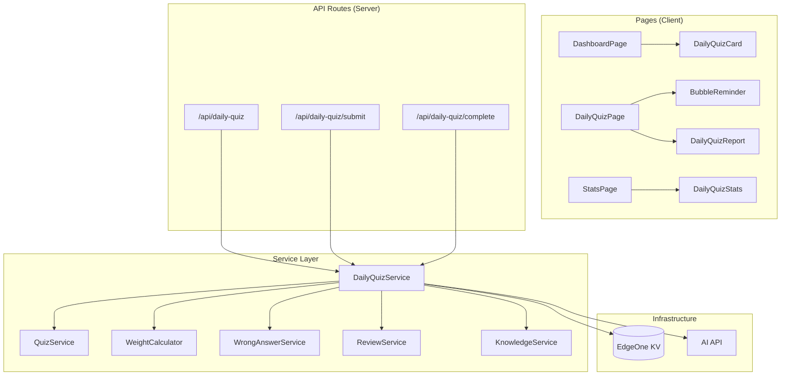
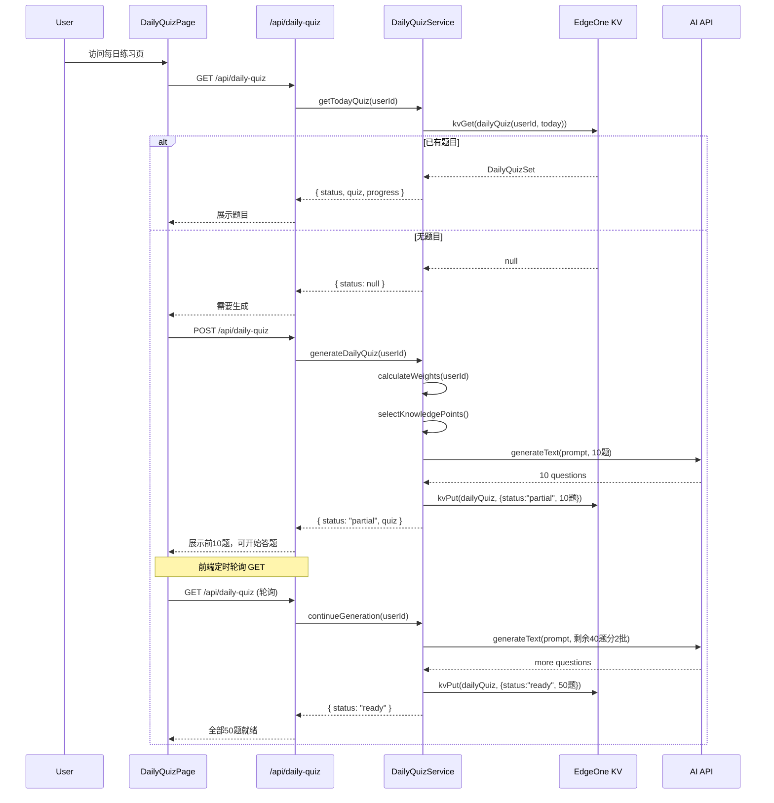
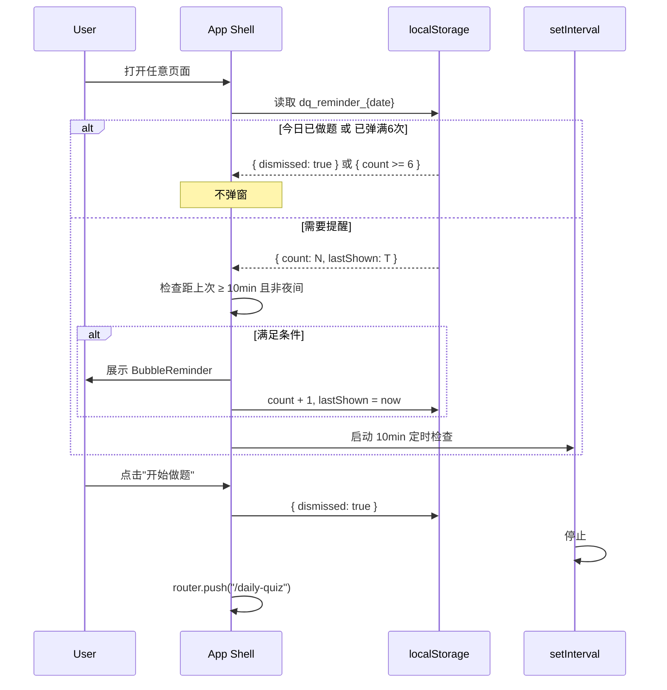
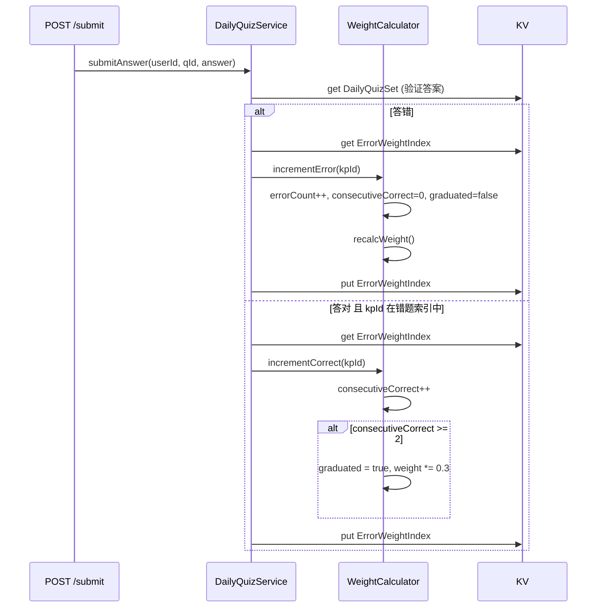

# 每日智能练习 (Daily Smart Quiz) 技术设计文档

## 1. 概述

### 1.1 文档目的

本文档定义「每日智能练习」功能的技术架构、数据模型、API 设计和核心流程，供编码阶段严格遵循。

### 1.2 相关需求

- 关联需求：[REQUIREMENT-daily-quiz.md](./REQUIREMENT-daily-quiz.md)
- 关联主设计：[DESIGN.md](./DESIGN.md)

---

## 2. 技术选型

### 2.1 技术栈（复用现有）

| 类别 | 选择 | 理由 |
|------|------|------|
| 框架 | Next.js 16 App Router | 现有项目框架 |
| 存储 | EdgeOne KV | 现有存储方案 |
| AI 出题 | Vercel AI SDK + Kimi API | 复用 QuizService 模式 |
| 定时 | 客户端惰性触发（无 Cron） | EdgeOne 无 Cron 支持 |
| UI | Tailwind + shadcn/ui | 现有 UI 体系 |
| Toast/Bubble | Sonner + 自定义 BubbleReminder | 新增冒泡组件 |
| 状态管理 | React useState + localStorage Timer | 轻量方案 |

### 2.2 决策记录 (ADR)

| # | 决策 | 备选 | 选择理由 |
|---|------|------|----------|
| ADR-1 | 惰性生成（首次访问触发） | 外部 Cron 预生成 | 无额外依赖；EdgeOne 不支持 Cron |
| ADR-2 | 分批生成（先10后40） | 一次性生成50题 | 首屏可用时间 < 15s |
| ADR-3 | Timer 存 localStorage | 服务端推送 | 无 WebSocket；PWA 局限 |
| ADR-4 | 错题权重存 KV Index | 实时计算 | 避免每次读全量错题数据 |
| ADR-5 | 复用 QuizService.generate 内核 | 新写 AI 调用 | 避免重复代码，Prompt 微调即可 |

---

## 3. 系统架构

### 3.1 模块划分

```
src/modules/daily-quiz/
├── index.ts                     # barrel exports
├── daily-quiz.types.ts          # 类型定义
├── daily-quiz.schema.ts         # Zod 校验
├── daily-quiz.service.ts        # 核心业务逻辑（生成/保存/查询）
├── daily-quiz.prompts.ts        # AI Prompt（错题变形）
├── daily-quiz.weight.ts         # 错题权重算法
└── components/
    ├── BubbleReminder.tsx       # 冒泡提醒组件
    ├── DailyQuizCard.tsx        # Dashboard 入口卡片
    └── DailyQuizReport.tsx      # 答题报告组件
```

```
src/app/
├── (app)/
│   └── daily-quiz/
│       ├── page.tsx             # 每日练习答题页
│       └── report/
│           └── page.tsx         # 答题报告页
├── api/
│   └── daily-quiz/
│       ├── route.ts             # GET: 获取今日题目 / POST: 触发生成
│       ├── submit/
│       │   └── route.ts         # POST: 提交单题答案
│       └── complete/
│           └── route.ts         # POST: 完成答题，生成报告
```

### 3.2 依赖关系



### 3.3 层次约束

| 层 | 可访问 | 不可访问 |
|---|--------|----------|
| Page (client) | API routes (fetch) | KV, Service 直接调用 |
| API Route (server) | Service, KV | 其他 API Route |
| Service | KV, AI, 其他 Service | Page |

---

## 4. 数据设计

### 4.1 KV Keys 扩展

在 `kv.keys.ts` 中新增：

```typescript
export const kvKeys = {
  // ... existing keys ...
  dailyQuiz: (userId: string, date: string) => `dq_${userId}_${date}`,
  dailyQuizProgress: (userId: string, date: string) => `dqp_${userId}_${date}`,
  dailyQuizResult: (userId: string, date: string) => `dqr_${userId}_${date}`,
  errorWeight: (userId: string) => `ew_${userId}`,
  quizCache: (userId: string) => `qc_${userId}`,
};
```

### 4.2 数据模型

```typescript
// ========== 每日题目集 ==========
interface DailyQuizSet {
  id: string;
  userId: string;
  date: string; // "YYYY-MM-DD"
  status: "generating" | "partial" | "ready" | "in_progress" | "completed";
  questions: DailyQuizQuestion[];
  totalCount: number;
  readyCount: number;
  generatedAt: string; // ISO datetime
  completedAt?: string;
}

interface DailyQuizQuestion {
  id: string;
  stem: string;
  options: QuizOption[]; // 复用 quiz.types.ts 的 QuizOption
  answer: string; // "A"|"B"|"C"|"D"|"E"
  explanation: string;
  sourceKpId: string;
  sourceType: "error_review" | "weak_area" | "new_coverage";
}

// ========== 答题进度 ==========
interface DailyQuizProgress {
  userId: string;
  date: string;
  currentIndex: number; // 当前做到第几题（0-based）
  answers: Record<string, string>; // questionId → userAnswer
  correctCount: number;
  startedAt: string;
  lastAnsweredAt: string;
}

// ========== 答题结果/报告 ==========
interface DailyQuizResult {
  userId: string;
  date: string;
  totalQuestions: number;
  correctCount: number;
  accuracy: number; // 0-100
  duration: number; // 秒
  weakCategories: { category: string; errorCount: number }[];
  errorKpIds: string[]; // 答错的知识点 ID 列表
  comparedToYesterday?: number; // 正确率变化
  streak: number; // 连续练习天数
  completedAt: string;
}

// ========== 错题权重索引 ==========
interface ErrorWeightIndex {
  userId: string;
  updatedAt: string;
  items: ErrorWeightItem[];
}

interface ErrorWeightItem {
  kpId: string;
  kpTitle: string;
  category: string[];
  errorCount: number;
  lastErrorDate: string;
  consecutiveCorrect: number;
  graduated: boolean;
  weight: number; // 计算后权重
}

// ========== 题目缓存池 ==========
interface QuizCachePool {
  userId: string;
  updatedAt: string;
  questions: CachedQuestion[]; // 最多 500 题
}

interface CachedQuestion {
  id: string;
  stem: string;
  options: QuizOption[];
  answer: string;
  explanation: string;
  sourceKpId: string;
  cachedAt: string;
}
```

### 4.3 数据生命周期

| 数据 | KV Key | 写入时机 | 清理策略 |
|------|--------|----------|----------|
| DailyQuizSet | `dq_{userId}_{date}` | 首次访问当日 | >7 天自动清理（先提取错题摘要） |
| DailyQuizProgress | `dqp_{userId}_{date}` | 每答一题 | >7 天自动清理（先提取错题摘要） |
| DailyQuizResult | `dqr_{userId}_{date}` | 答完全部题目 | 永久保留（体积小，用于统计） |
| ErrorWeightIndex | `ew_{userId}` | 每次答错/答对时更新 | 持续更新，清理时聚合历史错题 |
| QuizCachePool | `qc_{userId}` | 每次生成后缓存 | 滚动保留最新 500 题 |

**清理策略详述**：
- 触发时机：用户每日首次访问 `getTodayQuiz()` 时 fire-and-forget 执行
- 扫描范围：第 8 天 ~ 第 30 天（覆盖用户长时间不打开的情况）
- 清理内容：仅删除 QuizSet 和 Progress（大体积），保留 Result（小体积）
- 无需预提取摘要：错题信息在 submitAnswer 时已实时写入 ErrorWeightIndex（永久保留），清理时直接删除即可

### 4.4 存储预估

| 数据类型 | 单条大小 | 频率 | 7天累计 |
|----------|----------|------|---------|
| DailyQuizSet (50题) | ~50KB | 1/天 | ~350KB |
| DailyQuizProgress | ~5KB | 频繁更新 | 覆盖写 |
| DailyQuizResult | ~2KB | 1/天 | ~14KB |
| ErrorWeightIndex | ~10KB | 每次答题 | 覆盖写 |
| QuizCachePool | ~50KB | 渐增 | 上限 50KB |

单用户每日新增约 **57KB**，7 天约 **400KB**。

---

## 5. API 设计

### 5.1 接口列表

| 方法 | 路径 | 描述 |
|------|------|------|
| GET | `/api/daily-quiz` | 获取今日题目集状态和题目 |
| POST | `/api/daily-quiz` | 触发生成今日题目（如果未生成） |
| POST | `/api/daily-quiz/submit` | 提交单题答案 |
| POST | `/api/daily-quiz/complete` | 完成答题，生成报告 |

### 5.2 接口详情

#### GET /api/daily-quiz

获取当日题目集状态。

**Request:** 无 body，cookie 认证

**Response:**
```typescript
// 成功
{
  success: true,
  data: {
    status: "generating" | "partial" | "ready" | "in_progress" | "completed";
    quiz: DailyQuizSet | null;
    progress: DailyQuizProgress | null;
    result: DailyQuizResult | null; // status=completed 时返回
  }
}
```

#### POST /api/daily-quiz

触发生成今日题目（幂等：已存在则返回现有）。

**Request:** 无 body

**Response:**
```typescript
{
  success: true,
  data: {
    status: "generating" | "partial" | "ready";
    quiz: DailyQuizSet;
  }
}
```

**逻辑：**
1. 检查 `dq_{userId}_{today}` 是否存在
2. 存在且 status ≠ "generating" → 直接返回
3. 不存在 → 创建 set（status: "generating"）→ 生成首批 10 题 → 更新 status: "partial" → 后台继续生成 → 最终 status: "ready"
4. 由于 Edge 函数无后台线程，采用**同步分批**：首次调用生成 10 题返回 partial，前端轮询 GET 直到 ready

#### POST /api/daily-quiz/submit

提交单题答案。

**Request:**
```typescript
{
  questionId: string;
  answer: string; // "A"|"B"|"C"|"D"|"E"
}
```

**Response:**
```typescript
{
  success: true,
  data: {
    isCorrect: boolean;
    correctAnswer: string;
    explanation: string;
    progress: { currentIndex: number; correctCount: number; total: number };
  }
}
```

**逻辑：**
1. 读取 DailyQuizSet 获取正确答案
2. 判断对错
3. 更新 DailyQuizProgress
4. 如果答错 → 更新 ErrorWeightIndex
5. 如果答对 → 检查是否为之前的错题知识点，更新 consecutiveCorrect

#### POST /api/daily-quiz/complete

完成答题，生成报告。

**Request:** 无 body

**Response:**
```typescript
{
  success: true,
  data: DailyQuizResult
}
```

**逻辑：**
1. 读取 Progress + QuizSet
2. 计算正确率、用时、弱项分类
3. 获取昨日 Result 计算对比
4. 更新 DailyQuizSet status → "completed"
5. 写入 DailyQuizResult
6. 更新 EpisodeService.trackQuizScore（联动学习统计）
7. 将答错题目加入 QuizCachePool（供降级使用）

---

## 6. 核心流程

### 6.1 每日题目生成流程



### 6.2 冒泡提醒流程（客户端）



### 6.3 错题权重更新流程



---

## 7. 冒泡提醒组件设计

### 7.1 BubbleReminder 组件

```typescript
// Props
interface BubbleReminderProps {
  onStartQuiz: () => void;
}

// 内部状态管理（localStorage keys）
const STORAGE_KEY = "dq_reminder";
interface ReminderState {
  date: string;       // YYYY-MM-DD
  count: number;      // 已弹出次数
  lastShown: number;  // 上次弹出时间戳
  dismissed: boolean; // 今日是否已永久关闭
}
```

### 7.2 渲染规则

| 条件 | 行为 |
|------|------|
| dismissed = true | 不渲染 |
| count >= 6 | 不渲染 |
| 当前时间 22:00-07:00 | 不渲染 |
| 距上次弹出 < 10min | 不渲染 |
| 以上都不满足 | 渲染冒泡 |

### 7.3 UI 规格

- **位置**: `fixed bottom-20 left-1/2 -translate-x-1/2` (高于底部导航)
- **动画**: `animate-slide-up` + `animate-bounce-gentle` (Tailwind custom)
- **内容**: AI 伙伴头像(24px) + 文案 + "做题" Button + "×" 关闭
- **z-index**: 40 (低于 Dialog 的 50，高于底部导航)
- **文案**: 从文案池按 count 取对应文案

### 7.4 挂载位置

在 `src/app/(app)/layout.tsx` 中全局挂载 `<BubbleReminder />`，由组件内部判断是否显示。

---

## 8. 前端页面设计

### 8.1 路由规划

| 路由 | 页面 | 说明 |
|------|------|------|
| `/daily-quiz` | DailyQuizPage | 答题主页面 |
| `/daily-quiz/report` | DailyQuizReportPage | 答题完成报告 |

### 8.2 DailyQuizPage 状态机

```
初始 → [fetch GET /api/daily-quiz]
  │
  ├── status=null → 触发生成 → loading (骨架屏)
  ├── status=generating → loading (骨架屏 + 倒计时)
  ├── status=partial → 展示已有题目，可开始答 + 轮询
  ├── status=ready → 展示全部题目
  ├── status=in_progress → 从进度恢复
  └── status=completed → redirect to /daily-quiz/report
```

### 8.3 答题页组件结构

```
DailyQuizPage
├── Header (title="今日练习", left=返回, right=进度 "15/50")
├── Timer (计时器，右上角)
├── QuestionCard
│   ├── QuestionStem
│   └── OptionList (5个选项)
├── ProgressBar (底部进度条)
└── NavButtons (上一题 / 下一题)
```

### 8.4 Dashboard 集成

在 `/dashboard` 中现有 StatCard 网格后增加 `<DailyQuizCard />`：

```
DailyQuizCard (条件渲染)
├── 状态1: "今日练习已就绪 - 50道题等你挑战" + CTA
├── 状态2: "今日练习进行中 - 已完成 30/50" + 继续
├── 状态3: "今日练习已完成 ✓ - 正确率 78%" 
└── 状态4: "正在准备今日练习..." (生成中)
```

---

## 9. 错题权重算法实现

### 9.1 权重计算

```typescript
function calculateWeight(item: ErrorWeightItem): number {
  if (item.graduated) return item.errorCount * 0.3;

  const daysSinceError = daysBetween(item.lastErrorDate, today());
  const timeDecay = 1 / (1 + daysSinceError * 0.1);
  const importanceMultiplier = getImportanceMultiplier(item.kpId);

  return item.errorCount * timeDecay * importanceMultiplier;
}

function getImportanceMultiplier(kpId: string): number {
  // 基于 SM-2 card 的 efactor
  const card = getCardByKpId(kpId);
  if (!card) return 1;
  if (card.efactor < 1.5) return 2;
  if (card.efactor < 2.0) return 1.5;
  if (card.efactor > 2.5) return 0.5;
  return 1;
}
```

### 9.2 题目选择算法

```typescript
async function selectKnowledgePoints(userId: string): Promise<{
  errorReview: string[];  // 20 题的知识点
  weakArea: string[];     // 15 题的知识点
  newCoverage: string[];  // 15 题的知识点
}> {
  const [weights, cards, kpIndex] = await Promise.all([
    getErrorWeights(userId),
    getCardIndex(userId),
    getKnowledgeIndex(userId),
  ]);

  // 错题强化区: 按 weight 降序取 top-N (非毕业)
  const errorKps = weights.items
    .filter(w => !w.graduated && w.weight > 0)
    .sort((a, b) => b.weight - a.weight)
    .slice(0, 10) // 最多 10 个知识点，每个出 2 题
    .map(w => w.kpId);

  // 薄弱知识区: efactor < 2.0 且 repetition >= 1
  const weakKps = cards
    .filter(c => c.efactor < 2.0 && c.repetition >= 1)
    .filter(c => !errorKps.includes(c.kpId))
    .sort((a, b) => a.efactor - b.efactor)
    .slice(0, 8) // 最多 8 个知识点
    .map(c => c.kpId);

  // 新知识区: 从未出现在 cards 中 或 repetition=0
  const coveredKpIds = new Set(cards.map(c => c.kpId));
  const newKps = kpIndex
    .filter(kp => !coveredKpIds.has(kp.id))
    .slice(0, 8)
    .map(kp => kp.id);

  return { errorReview: errorKps, weakArea: weakKps, newCoverage: newKps };
}
```

### 9.3 LRU 淘汰机制

ErrorWeightIndex 上限为 **100 条**，超出时按以下优先级淘汰：

| 优先级 | 淘汰对象 | 理由 |
|--------|----------|------|
| 1（最先淘汰） | `graduated = true` 的条目 | 已掌握，不再需要强化 |
| 2 | 最旧 + 最低权重的条目 | `score = weight × (1/daysSinceLastError)` 最低者 |

**合并更新**：相同知识点的错题不会产生新条目，而是累加 `errorCount` 并刷新 `lastErrorDate`。

### 9.4 出题比例与降级

| 区域 | 目标题数 | 知识点不足时 |
|------|----------|-------------|
| 错题强化 | 20 | 不足的分配给薄弱区 |
| 薄弱知识 | 15 | 不足的分配给新知识区 |
| 新知识 | 15 | 不足的从所有知识点随机抽取 |

---

## 10. AI Prompt 设计

### 10.1 标准出题 Prompt

复用现有 `quiz.prompts.ts` 的 `buildQuizPrompt`，参数微调：
- `count`: 按批次（10 / 20 / 20）
- `knowledgePoints`: 按区域筛选的知识点内容

### 10.2 错题变形 Prompt（新增）

```typescript
function buildErrorReviewPrompt(kpContent: string, previousQuestion: string): string {
  return `你是一位医学教育专家。基于以下知识点，请生成一道与之前题目不同角度的 A1 型选择题。

知识点内容：
${kpContent}

之前的题目（请换一个考查角度）：
${previousQuestion}

要求：
1. 从不同角度考查同一知识点（如之前考病因，这次考临床表现）
2. 5个选项(A-E)，只有一个正确答案
3. 干扰选项具有迷惑性但可区分
4. 提供简洁的解析说明

输出 JSON 格式：
{"stem":"题干","options":[{"label":"A","text":"选项A"},...],  "answer":"正确选项字母","explanation":"解析"}`;
}
```

---

## 11. 非功能设计

### 11.1 性能

| 场景 | 目标 | 方案 |
|------|------|------|
| 首批题目生成 | < 15s | 先生成 10 题即返回 |
| 提交答案 | < 500ms | KV 读写 + 内存计算 |
| 冒泡弹出 | < 100ms | 纯客户端 localStorage |
| 轮询间隔 | 3s | 前端 setInterval + 状态判断停止 |

### 11.2 可靠性

| 故障场景 | 降级方案 |
|----------|----------|
| AI 生成失败 | 从 QuizCachePool 抽取历史题目 |
| AI 部分失败 | 展示已生成的题目（标注"缩减版"） |
| KV 写入失败 | 客户端 localStorage 暂存，下次同步 |
| 进度丢失 | 每题提交时写入，最多丢失 1 题进度 |

### 11.3 安全

- 所有 API 路由需 `getUserId(req)` 认证
- 题目答案在 submit 时才返回（不提前暴露）
- 错误权重只属于当前用户（userId 隔离）

---

## 12. 风险与约束

| 风险 | 影响 | 概率 | 缓解 |
|------|------|------|------|
| AI 生成慢 (>30s) | 用户等待体验差 | 中 | 分批 + 缓存池降级 |
| KV 存储增长 | 接近 1GB 限额 | 低 | 7天自动过期 + 用户少 |
| 知识点太少 | 无法凑满 50 题 | 中 | 动态调整题数，最少 10 题 |
| 前端 Timer 不准 | 冒泡间隔偏差 | 低 | 基于时间戳比较而非 setTimeout |

---

## 13. 与现有模块的集成点

| 模块 | 集成方式 |
|------|----------|
| `quiz` | 复用 `QuizService.generate` 的 AI 调用模式和 Prompt 构建 |
| `exam/wrong-answers` | 读取 `WrongAnswerService.getIndex` 获取已有错题 |
| `review` | 读取 `ReviewService.getCardIndex` 获取 efactor/repetition |
| `knowledge` | 读取 `KnowledgeService.getIndex/get` 获取知识点内容 |
| `agent/episode` | `EpisodeService.trackQuizScore` 记录每日得分 |
| Dashboard | 新增 `DailyQuizCard` 组件嵌入 |
| Stats | 新增每日练习统计板块 |
| Layout | 全局挂载 `BubbleReminder` |

---

## 14. 附录

### 14.1 文案池常量

```typescript
export const REMINDER_MESSAGES = [
  "主人，今天的50道题已经准备好啦~ 趁热做吧！",
  "主人，要不先做10道？只需5分钟~",
  "今天的题目里有你上次的易错点哦，来挑战一下？",
  "坚持每天练习的人，通过率提升30%呢！加油~",
  "最后一次提醒啦~ 主人今天要做练习吗？",
  "好的主人，今天不打扰了。明天继续加油！",
] as const;

export const STREAK_MESSAGE = (n: number) =>
  `主人已经连续练习${n}天了！今天也来保持记录吧~`;

export const IMPROVEMENT_MESSAGE = (pct: number) =>
  `昨天正确率${pct}%，今天一定能更好！冲~`;
```

### 14.2 Tailwind 动画扩展

```css
/* tailwind.config 中新增 */
@keyframes slide-up {
  from { transform: translateY(100%); opacity: 0; }
  to { transform: translateY(0); opacity: 1; }
}
@keyframes bounce-gentle {
  0%, 100% { transform: translateY(0); }
  50% { transform: translateY(-4px); }
}
```
