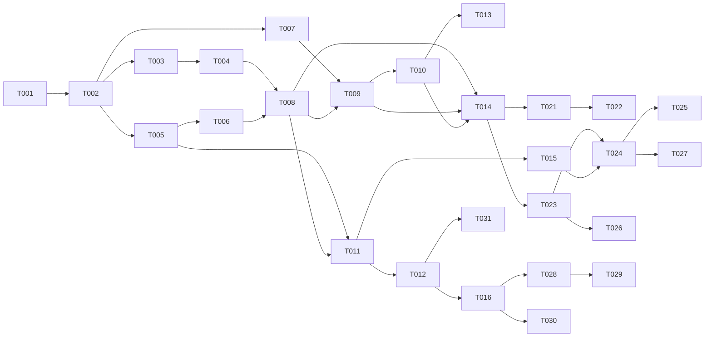

# 每日智能练习 (Daily Smart Quiz) 任务清单

## 概述

- 关联需求：[REQUIREMENT-daily-quiz.md](./REQUIREMENT-daily-quiz.md)
- 关联设计：[DESIGN-daily-quiz.md](./DESIGN-daily-quiz.md)
- 预计任务数：32 个
- 预计总工时：约 6 小时

## 任务状态说明

- 🔲 待开始
- 🔄 进行中
- ✅ 已完成
- ⏸️ 阻塞中
- ❌ 已取消

---

## Phase 1: 基础设施 & 类型定义

### 1.1 KV Keys 扩展

| ID | 任务 | 状态 | DoD | 依赖 | 预估 |
|----|------|------|-----|------|------|
| T001 | 在 `kv.keys.ts` 中添加 daily-quiz 相关 key 函数 | 🔲 | dailyQuiz/dailyQuizProgress/dailyQuizResult/errorWeight/quizCache 5 个 key 函数已添加 | - | 3min |

### 1.2 类型定义

| ID | 任务 | 状态 | DoD | 依赖 | 预估 |
|----|------|------|-----|------|------|
| T002 | 创建 `daily-quiz.types.ts` — 定义所有接口类型 | 🔲 | DailyQuizSet/DailyQuizQuestion/DailyQuizProgress/DailyQuizResult/ErrorWeightIndex/ErrorWeightItem/QuizCachePool/CachedQuestion 类型完整 | T001 | 10min |
| T003 | 创建 `daily-quiz.schema.ts` — Zod 校验 Schema | 🔲 | SubmitAnswerSchema 验证 questionId + answer | T002 | 5min |

### 1.3 模块骨架

| ID | 任务 | 状态 | DoD | 依赖 | 预估 |
|----|------|------|-----|------|------|
| T004 | 创建 `src/modules/daily-quiz/index.ts` barrel 文件 | 🔲 | 导出所有 public API | T002, T003 | 2min |

---

## Phase 2: 错题权重算法

### 2.1 权重计算

| ID | 任务 | 状态 | DoD | 依赖 | 预估 |
|----|------|------|-----|------|------|
| T005 | 创建 `daily-quiz.weight.ts` — 权重计算函数 | 🔲 | calculateWeight() 按公式计算；getImportanceMultiplier() 基于 efactor | T002 | 10min |
| T006 | 实现知识点选择算法 `selectKnowledgePoints()` | 🔲 | 按三区策略分配知识点；处理不足情况的降级逻辑 | T005 | 15min |

---

## Phase 3: AI Prompt & 核心 Service

### 3.1 Prompt 构建

| ID | 任务 | 状态 | DoD | 依赖 | 预估 |
|----|------|------|-----|------|------|
| T007 | 创建 `daily-quiz.prompts.ts` — 标准出题 + 错题变形 Prompt | 🔲 | buildDailyQuizPrompt() + buildErrorReviewPrompt() 函数完整 | T002 | 10min |

### 3.2 Service 主体

| ID | 任务 | 状态 | DoD | 依赖 | 预估 |
|----|------|------|-----|------|------|
| T008 | 实现 `DailyQuizService.getTodayQuiz()` — 获取今日题目集状态 | 🔲 | 读取 KV，返回 quiz+progress+result 状态 | T004, T006 | 10min |
| T009 | 实现 `DailyQuizService.generateDailyQuiz()` — 首批 10 题生成 | 🔲 | 创建 DailyQuizSet(status:partial)；调用 AI 生成 10 题；写入 KV | T007, T008 | 15min |
| T010 | 实现 `DailyQuizService.continueGeneration()` — 继续生成剩余题目 | 🔲 | 检查当前已有题目数；生成至 50 题；更新 status 为 ready | T009 | 15min |
| T011 | 实现 `DailyQuizService.submitAnswer()` — 提交单题答案 | 🔲 | 验证答案对错；更新 Progress；答错更新 ErrorWeight；返回结果 | T005, T008 | 15min |
| T012 | 实现 `DailyQuizService.completeQuiz()` — 完成答题生成报告 | 🔲 | 计算正确率/用时/弱项；生成 DailyQuizResult；更新 QuizSet status；调用 EpisodeService | T011 | 15min |
| T013 | 实现降级逻辑 — AI 失败时从 QuizCachePool 抽题 | 🔲 | 缓存池读取 + 随机抽取 + 写入题目集 | T010 | 10min |

---

## Phase 4: API 路由

### 4.1 路由实现

| ID | 任务 | 状态 | DoD | 依赖 | 预估 |
|----|------|------|-----|------|------|
| T014 | 创建 `src/app/api/daily-quiz/route.ts` — GET + POST | 🔲 | GET 返回今日状态；POST 触发生成（幂等）；认证 + 错误处理 | T008, T009, T010 | 10min |
| T015 | 创建 `src/app/api/daily-quiz/submit/route.ts` — POST | 🔲 | 验证输入；调用 submitAnswer；返回对错+进度 | T011 | 8min |
| T016 | 创建 `src/app/api/daily-quiz/complete/route.ts` — POST | 🔲 | 调用 completeQuiz；返回报告数据 | T012 | 8min |

---

## Phase 5: 前端组件

### 5.1 冒泡提醒

| ID | 任务 | 状态 | DoD | 依赖 | 预估 |
|----|------|------|-----|------|------|
| T017 | 创建 `BubbleReminder.tsx` — 冒泡组件 UI | 🔲 | AI 头像 + 文案 + CTA + 关闭按钮；slide-up 动画 | - | 15min |
| T018 | 实现 BubbleReminder 逻辑 — localStorage Timer | 🔲 | 10min 间隔重弹；6次上限；夜间免打扰；点击做题永久关闭 | T017 | 15min |
| T019 | 添加 Tailwind 动画 — slide-up + bounce-gentle | 🔲 | 在全局 CSS 中新增 keyframes 和 utility class | - | 5min |
| T020 | 在 `(app)/layout.tsx` 挂载 BubbleReminder | 🔲 | 全局渲染；不影响现有布局 | T018 | 5min |

### 5.2 Dashboard 卡片

| ID | 任务 | 状态 | DoD | 依赖 | 预估 |
|----|------|------|-----|------|------|
| T021 | 创建 `DailyQuizCard.tsx` — Dashboard 入口卡片 | 🔲 | 4 种状态展示；Link 跳转到 /daily-quiz | T014 | 10min |
| T022 | 在 `dashboard/page.tsx` 集成 DailyQuizCard | 🔲 | 放置在 StatCard 网格下方；条件渲染 | T021 | 5min |

### 5.3 答题页面

| ID | 任务 | 状态 | DoD | 依赖 | 预估 |
|----|------|------|-----|------|------|
| T023 | 创建 `/daily-quiz/page.tsx` — 页面骨架 + 状态机 | 🔲 | 初始 fetch；loading/generating/ready/in_progress 状态切换 | T014 | 15min |
| T024 | 实现答题交互 — 选项点击 + 即时反馈 + 翻页 | 🔲 | 选择选项→submit→显示对错+解析→下一题按钮 | T015, T023 | 15min |
| T025 | 实现进度条 + 计时器 | 🔲 | 顶部进度 "15/50"；右侧计时 mm:ss；底部进度条 | T024 | 10min |
| T026 | 实现轮询生成状态（partial→ready） | 🔲 | 3s 轮询 GET；ready 后停止轮询；展示新题目 | T023 | 8min |
| T027 | 实现中途退出保护 | 🔲 | 返回按钮弹确认 Dialog；显示"进度已保存" | T024 | 8min |

### 5.4 报告页面

| ID | 任务 | 状态 | DoD | 依赖 | 预估 |
|----|------|------|-----|------|------|
| T028 | 创建 `/daily-quiz/report/page.tsx` — 答题报告 | 🔲 | 正确率环形图；用时；弱项分类；与昨日对比；streak | T016 | 15min |
| T029 | 实现"查看错题详解"展开 | 🔲 | 错题列表；点击展开题目+解析；标注知识点来源 | T028 | 10min |

### 5.5 Stats 集成

| ID | 任务 | 状态 | DoD | 依赖 | 预估 |
|----|------|------|-----|------|------|
| T030 | 在 Stats 页新增"每日练习"板块 | 🔲 | 连续天数 + 7 天正确率折线图 + 今日状态 | T016 | 15min |
| T031 | 扩展 `/api/stats` 返回每日练习统计数据 | 🔲 | 近 7 天 DailyQuizResult 汇总；练习 streak 计算 | T012 | 10min |

---

## Phase 6: 集成与验证

| ID | 任务 | 状态 | DoD | 依赖 | 预估 |
|----|------|------|-----|------|------|
| T032 | 端到端功能验证 — 生成→做题→报告→冒泡完整流程 | 🔲 | 打开 /daily-quiz 可正常生成/答题/完成；冒泡正常弹出/关闭 | ALL | 15min |

---

## 依赖关系图

## 执行策略

**推荐顺序**：

1. **第一批（基础）**: T001 → T002 → T003 → T004 → T005 → T006 → T007
2. **第二批（Service）**: T008 → T009 → T010 → T011 → T012 → T013
3. **第三批（API）**: T014 → T015 → T016
4. **第四批（前端核心）**: T017 → T018 → T019 → T020 → T023 → T024 → T025 → T026 → T027
5. **第五批（前端扩展）**: T021 → T022 → T028 → T029 → T030 → T031
6. **第六批（验证）**: T032

## 风险与阻塞

| 风险 | 影响任务 | 缓解 |
|------|----------|------|
| AI Prompt 需调优 | T009, T010 | 先用固定 Mock 数据测通流程 |
| KV 并发写冲突 | T011 | 用乐观覆盖策略（最后写入胜出） |
| 首次生成超时 | T009 | 分批 + 错误捕获 + 降级到缓存 |
