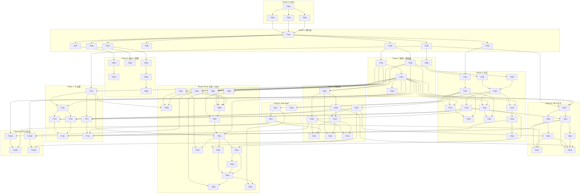

# Med-Recallix 任务清单

## 概述
- 关联需求：[REQUIREMENT.md](./REQUIREMENT.md)
- 关联设计：[DESIGN.md](./DESIGN.md)
- MVP 任务数：62 个（Phase 0-8）
- P1 任务数：28 个（Phase 9-10）
- 预计 MVP 总工时：约 12-15 小时

## 任务状态说明
- 🔲 待开始
- 🔄 进行中
- ✅ 已完成
- ⏸️ 阻塞中
- ❌ 已取消

---

## Phase 0: 技术验证 Spike

> 在正式开发前验证三个关键技术风险点。

| ID | 任务 | 预估 | 状态 | DoD | 依赖 |
|----|------|------|------|-----|------|
| T001 | 创建最小 Next.js 项目，部署到 EdgeOne Pages 验证流程 | 10min | ✅ | 项目可访问 | - |
| T002 | 在 Route Handler 中验证 KV 绑定变量可访问 | 10min | 🔲 | API 返回 KV 读写结果 | T001 |
| T003 | 验证 Web Crypto PBKDF2 在 Edge Runtime 的性能（100K 迭代） | 5min | 🔲 | 延迟 < 500ms | T001 |
| T004 | 验证 Vercel AI SDK 连接 Kimi API 流式输出 | 10min | 🔲 | 流式文本可正常输出 | T001 |

**Spike 决策点**：
- T002 失败 → 改用 `/functions/` 目录模式，调整所有 API 路由设计
- T004 失败 → 降级为直接 fetch OpenAI 兼容 API

---

## Phase 1: 项目脚手架

| ID | 任务 | 预估 | 状态 | DoD | 依赖 |
|----|------|------|------|-----|------|
| T101 | `pnpm create next-app` 初始化 Next.js 15 + TypeScript + App Router + Tailwind CSS 4 | 5min | ✅ | `pnpm dev` 可运行 | T001-T004 |
| T102 | 安装核心依赖：supermemo, ai, jose, nanoid, zod, idb, dayjs, lucide-react | 5min | ✅ | `pnpm install` 无报错 | T101 |
| T103 | 创建项目目录结构：`src/{app,modules,shared}` + `public/` + `scripts/`，配置 tsconfig paths `@/*` | 5min | ✅ | 目录结构符合 DESIGN.md 3.2 节，路径别名生效 | T101 |
| T104 | 配置 `next.config.ts`（Edge Runtime 默认配置） | 5min | ✅ | 构建无报错 | T101 |
| T105 | 创建 `app/manifest.ts`（PWA manifest） | 5min | ✅ | `/manifest.json` 可访问且格式正确 | T101 |
| T106 | 创建 PWA 图标占位文件 (192x192, 512x512 PNG) | 5min | ✅ | public/icons/ 下有图标文件 | T101 |
| T107 | 创建根 `app/layout.tsx`（字体、主题色、元数据、viewport） | 10min | ✅ | 页面可渲染，meta 标签正确 | T101 |
| T108 | 配置 Tailwind 主题色（Indigo 主色调、移动端优先断点） | 5min | ✅ | 自定义颜色可用 | T101 |
| T109 | 配置 `.gitignore`、`.env.example`、`edgeone.json` | 5min | ✅ | 文件存在且内容正确 | T101 |
| T110 | 生成项目 Logo（SVG/PNG）到 `docs/assets/` 和 `public/icons/` | 10min | 🔲 | Logo 在 README 和 PWA 中正确显示 | T101 |

---

## Phase 2: 类型定义 + 基础库

| ID | 任务 | 预估 | 状态 | DoD | 依赖 |
|----|------|------|------|-----|------|
| T201 | 定义共享类型 (`shared/types/`)：ApiResponse, ApiError, env.d.ts | 10min | ✅ | 全局类型编译通过 | T103 |
| T202 | 定义各模块类型：auth.types, knowledge.types, review.types, quiz.types（各模块 `{feature}.types.ts`） | 15min | ✅ | 各模块类型可导出使用 | T103 |
| T203 | 实现 KV 基础设施 (`shared/infrastructure/kv/`)：kv.client.ts 泛型封装 + kv.keys.ts Key 构建函数 | 15min | ✅ | KV 读写函数可调用，Key 生成器类型安全 | T201 |
| T204 | 实现 KV 本地 Mock (`shared/infrastructure/kv/kv.mock.ts`)：开发环境 Map 模拟 | 10min | ✅ | `pnpm dev` 时 KV 操作不报错 | T203 |
| T205 | 实现共享工具库 (`shared/lib/`)：utils.ts (nanoid, cn, dayjs), errors.ts (AppError), validators.ts | 10min | ✅ | 函数可正常调用 | T102 |

---

## Phase 3: 认证系统

### 3.1 认证核心库

| ID | 任务 | 预估 | 状态 | DoD | 依赖 |
|----|------|------|------|-----|------|
| T301 | 实现 auth 模块 service (`modules/auth/auth.service.ts`)：PBKDF2 哈希 + JWT 签发验证 + Cookie | 15min | ✅ | hashPassword / signJWT / setCookie 可调用 | T205 |
| T302 | 实现 auth 模块 schema (`modules/auth/auth.schema.ts`)：LoginInput, RegisterInput Zod 校验 | 5min | ✅ | Schema parse 可校验输入 | T202 |
| T303 | 实现 auth 模块 barrel export (`modules/auth/index.ts`) + constants | 5min | ✅ | import from '@/modules/auth' 可用 | T301, T302 |

### 3.2 认证 API

| ID | 任务 | 预估 | 状态 | DoD | 依赖 |
|----|------|------|------|-----|------|
| T311 | 实现 `POST /api/auth/register`（薄层模式）：Schema 校验 → AuthService.register → 响应 | 15min | ✅ | 注册成功返回 201 + Set-Cookie | T303, T203 |
| T312 | 实现 `POST /api/auth/login`（薄层模式）：Schema 校验 → AuthService.login → 响应 | 10min | ✅ | 登录成功返回 200 + Set-Cookie | T303, T203 |
| T313 | 实现 `GET /api/auth/me`：从 JWT 解析当前用户 | 5min | ✅ | 返回当前用户信息或 401 | T303, T203 |
| T314 | 实现 Next.js Middleware (`src/middleware.ts`)：拦截受保护路由、验证 JWT、注入 userId | 15min | ✅ | 未登录访问 /dashboard 重定向到 /login | T303 |

### 3.3 认证 UI

| ID | 任务 | 预估 | 状态 | DoD | 依赖 |
|----|------|------|------|-----|------|
| T321 | 初始化 shadcn/ui 到 `src/shared/components/ui/`：安装 CLI、配置路径别名 | 5min | ✅ | `npx shadcn@latest add button` 输出到正确目录 | T108 |
| T322 | 添加 shadcn 基础组件到 `shared/components/ui/`：Button, Input, Card, Label, Toast | 5min | ✅ | 组件可从 `@/shared/components/ui` 导入 | T321 |
| T323 | 实现 auth 模块登录表单组件 (`modules/auth/components/login-form.tsx`) + 登录页 | 15min | ✅ | 可输入用户名密码登录 | T312, T322 |
| T324 | 实现 auth 模块注册表单组件 (`modules/auth/components/register-form.tsx`) + 注册页 | 10min | ✅ | 可注册新用户，跳转到 dashboard | T311, T322 |
| T325 | 实现 auth 模块 `use-auth` hook (`modules/auth/use-auth.ts`)：获取当前用户、登出 | 10min | ✅ | 组件可获取登录状态 | T313 |
| T326 | 实现着陆页 (`app/page.tsx`)：未登录引导登录，已登录跳转 dashboard | 5min | ✅ | 根据登录状态正确跳转 | T325 |

---

## Phase 4: App Shell 布局

| ID | 任务 | 预估 | 状态 | DoD | 依赖 |
|----|------|------|------|-----|------|
| T401 | 实现共享布局组件 (`shared/components/layout/`)：bottom-nav, header, page-container | 15min | ✅ | 从 `@/shared/components/layout` 导入可用 | T322 |
| T402 | 实现 App Shell 布局 (`app/(app)/layout.tsx`)：组合 Header + BottomNav + PageContainer | 10min | ✅ | 子页面在 Shell 内渲染，可滚动 | T401 |
| T403 | 实现全局错误边界 (`app/error.tsx`) + 404 页面 (`app/not-found.tsx`) + 加载骨架 (`app/loading.tsx`) | 10min | ✅ | 错误和加载状态友好显示 | T322 |

---

## Phase 5: 知识点管理

### 5.1 知识点 API

| ID | 任务 | 预估 | 状态 | DoD | 依赖 |
|----|------|------|------|-----|------|
| T501 | 实现 knowledge 模块 service + schema (`modules/knowledge/`)：CRUD + 索引管理 + 分类树维护 | 15min | ✅ | KnowledgeService.create/list/get/update/delete 可调用 | T203, T202 |
| T502 | 实现 knowledge API routes（薄层）：POST + GET `/api/knowledge`，GET + PUT + DELETE `/api/knowledge/[id]` | 15min | ✅ | 5 个端点可正常响应 | T501, T314 |
| T503 | 实现 knowledge barrel export (`modules/knowledge/index.ts`) | 3min | ✅ | import from '@/modules/knowledge' 可用 | T501 |

### 5.2 知识点 UI 组件

| ID | 任务 | 预估 | 状态 | DoD | 依赖 |
|----|------|------|------|-----|------|
| T511 | 添加 shadcn 扩展组件到 `shared/components/ui/`：Dialog, Select, Textarea, Badge, Separator, ScrollArea | 5min | ✅ | 组件可从 `@/shared/components/ui` 导入 | T322 |
| T512 | 实现 knowledge 模块组件 (`modules/knowledge/components/`)：category-tree, knowledge-card, knowledge-form | 15min | ✅ | 三个组件可从 `@/modules/knowledge` 导入 | T511, T503 |

### 5.3 知识点页面

| ID | 任务 | 预估 | 状态 | DoD | 依赖 |
|----|------|------|------|-----|------|
| T521 | 实现知识点列表页 (`app/(app)/knowledge/page.tsx`)：分类浏览 + 搜索 + 新建按钮 | 15min | ✅ | 列表加载展示，搜索可过滤 | T502, T512, T402 |
| T522 | 实现新建知识点页 (`app/(app)/knowledge/new/page.tsx`)：表单 + 提交 | 10min | ✅ | 填写提交后跳转到列表页 | T501, T512 |
| T523 | 实现知识点详情/编辑页 (`app/(app)/knowledge/[id]/page.tsx`)：查看 + 编辑 + 删除 | 15min | ✅ | 详情展示、编辑保存、删除确认 | T502, T512 |

---

## Phase 6: SM-2 复习引擎

### 6.1 SM-2 核心

| ID | 任务 | 预估 | 状态 | DoD | 依赖 |
|----|------|------|------|-----|------|
| T601 | 实现 review 模块核心 (`modules/review/`)：sm2.ts 算法封装 + review.service.ts 卡片 CRUD + review.schema.ts | 15min | ✅ | SM-2 计算正确，Service 可管理 deck | T102, T202, T203 |
| T602 | 实现 review barrel export (`modules/review/index.ts`) | 3min | ✅ | import from '@/modules/review' 可用 | T601 |

### 6.2 复习 API

| ID | 任务 | 预估 | 状态 | DoD | 依赖 |
|----|------|------|------|-----|------|
| T611 | 实现 cards API routes（薄层）：GET `/api/cards` + PUT `/api/cards/[id]` | 10min | ✅ | 返回到期卡片列表，评分后更新正确 | T601, T314 |

### 6.3 复习 UI

| ID | 任务 | 预估 | 状态 | DoD | 依赖 |
|----|------|------|------|-----|------|
| T621 | 实现 review 模块组件 (`modules/review/components/`)：review-card (翻转), rating-buttons, due-summary, streak-badge | 15min | ✅ | 翻转动画流畅，组件可从 `@/modules/review` 导入 | T511, T602 |
| T622 | 实现 review 模块 `use-review` hook (`modules/review/use-review.ts`)：复习会话状态机 | 10min | ✅ | 复习状态管理正确 | T611 |
| T623 | 实现 Dashboard 页面 (`app/(app)/dashboard/page.tsx`)：概览 + 开始复习按钮 + AI 伙伴督促语 | 15min | ✅ | 展示今日复习状态，可点击进入复习 | T611, T621, T402 |
| T624 | 实现复习会话页 (`app/(app)/review/page.tsx`)：翻卡 → 评分 → 下一张 → 完成总结 | 15min | ✅ | 完整复习流程可走通 | T611, T621, T622, T503 |

---

## Phase 7: AI 出题

### 7.1 AI 核心

| ID | 任务 | 预估 | 状态 | DoD | 依赖 |
|----|------|------|------|-----|------|
| T701 | 实现 AI 基础设施 (`shared/infrastructure/ai/`)：ai.client.ts + ai.config.ts | 10min | ✅ | createOpenAI 实例可调用，配置可从 KV 读取 | T102, T203 |
| T702 | 实现 quiz 模块 (`modules/quiz/`)：quiz.service.ts + quiz.schema.ts + quiz.prompts.ts + quiz.types.ts + index.ts | 15min | ✅ | QuizService.generate 可调用 | T701, T202 |

### 7.2 AI 配置 API

| ID | 任务 | 预估 | 状态 | DoD | 依赖 |
|----|------|------|------|-----|------|
| T711 | 实现 config API routes：GET + PUT `/api/config` | 10min | ✅ | AI 配置可读写，key 脱敏 | T701, T314 |

### 7.3 出题 API

| ID | 任务 | 预估 | 状态 | DoD | 依赖 |
|----|------|------|------|-----|------|
| T721 | 实现 quiz API route（薄层）：POST `/api/quiz/generate` | 10min | ✅ | 流式返回题目 JSON | T702, T503, T314 |

### 7.4 出题 UI

| ID | 任务 | 预估 | 状态 | DoD | 依赖 |
|----|------|------|------|-----|------|
| T731 | 实现 quiz 模块组件 (`modules/quiz/components/`)：quiz-question, quiz-result + use-quiz hook | 15min | ✅ | 组件可从 `@/modules/quiz` 导入 | T511, T702 |
| T732 | 实现出题页面 (`app/(app)/quiz/page.tsx`)：选知识点 → 生成 → 答题 → 结果 | 15min | ✅ | 完整出题答题流程可走通 | T721, T731, T502 |

### 7.5 设置页

| ID | 任务 | 预估 | 状态 | DoD | 依赖 |
|----|------|------|------|-----|------|
| T741 | 实现设置页面 (`app/(app)/settings/page.tsx`)：AI 配置表单 + 个人信息 + 登出 | 15min | ✅ | AI 配置可编辑保存，可登出 | T711, T325, T402 |

---

## Phase 8: PWA + 部署

| ID | 任务 | 预估 | 状态 | DoD | 依赖 |
|----|------|------|------|-----|------|
| T801 | 创建 Service Worker (`public/sw.js`)：静态资源 Cache First + HTML Network First | 10min | 🔲 | 离线可展示缓存页面 | T107 |
| T802 | 在 `layout.tsx` 注册 Service Worker | 5min | 🔲 | SW 注册成功，DevTools 可见 | T801 |
| T803 | 生成正式 PWA 图标（替换占位文件） | 10min | 🔲 | 图标清晰，品牌风格一致 | T106 |
| T804 | 配置 `edgeone.json`（构建命令、输出目录、KV 绑定） | 5min | 🔲 | 配置文件格式正确 | T104 |
| T805 | Git 推送 → EdgeOne Pages 首次完整部署 | 10min | 🔲 | 线上可访问，KV 绑定生效 | T804 |
| T806 | 线上端到端验收：注册 → 创建知识点 → 出题 → 复习 → PWA 安装 | 15min | 🔲 | 全流程可走通 | T805 |

---

## Phase 9 [P1]: AI 对话 + Agent 记忆系统

> 此阶段为 P1 优先级，MVP 完成后开发。

### 9.1 Agent 核心库

| ID | 任务 | 预估 | 状态 | DoD | 依赖 |
|----|------|------|------|-----|------|
| T901 | 实现 agent 模块核心常量 (`modules/agent/soul.ts`)：人格 + 行为规则 | 10min | ✅ | 常量可从 `@/modules/agent` 导出 | T202 |
| T902 | 实现 agent 模块 profile service (`modules/agent/profile.service.ts`)：用户画像读写 | 10min | ✅ | getProfile/updateProfile 可调用 | T203, T201 |
| T903 | 实现 agent 模块 memory service (`modules/agent/memory.service.ts`)：长期记忆写入/召回/关键词匹配 | 15min | ✅ | addMemory/recallMemories 可调用 | T203, T201 |
| T904 | 实现 agent 模块 episode service (`modules/agent/episode.service.ts`)：每日情景记忆 | 10min | ✅ | getEpisode/updateEpisode 可调用 | T203, T201 |
| T905 | 实现 agent 模块 compaction service（集成到 chat.service.ts）：对话摘要压缩 + 记忆提取 | 15min | ✅ | 对话 >40 条自动压缩，上下文窗口 20 条 | T903, T904, T701 |
| T906 | 实现 agent 模块上下文组装 (`modules/agent/context-builder.ts`)：优先级窗口填充 | 15min | ✅ | buildContext 返回有序 messages | T901-T904 |
| T907 | 实现 agent barrel export (`modules/agent/index.ts`) + agent.types.ts | 5min | ✅ | import from '@/modules/agent' 可用 | T901-T906 |

### 9.2 对话 API

| ID | 任务 | 预估 | 状态 | DoD | 依赖 |
|----|------|------|------|-----|------|
| T911 | 实现 chat 模块 (`modules/chat/`)：chat.service.ts + chat.schema.ts + chat.types.ts + index.ts | 15min | ✅ | ChatService.send/listSessions/getHistory 可调用 | T907, T701, T203 |
| T912 | 实现 chat API routes（薄层）：POST + GET `/api/chat`, GET + DELETE `/api/chat/[sessionId]` | 10min | ✅ | 4 个端点可正常响应 | T911, T314 |
| T913 | 实现 Agent 自主记忆写入：AI 回复后分析是否写入长期记忆 | 15min | ✅ | AI 回复后异步提取记忆，自动写入 MemoryService | T903, T911 |

### 9.3 对话 UI

| ID | 任务 | 预估 | 状态 | DoD | 依赖 |
|----|------|------|------|-----|------|
| T921 | 实现 chat 模块组件 (`modules/chat/components/`)：message-bubble, message-list, chat-input, session-list | 15min | ✅ | 组件可从 `@/modules/chat` 导入 | T511, T911 |
| T922 | 实现 chat 模块 `use-chat` hook (`modules/chat/use-chat.ts`)：流式接收 | 15min | ✅ | 流式显示打字效果 | T912 |
| T923 | 实现对话页面 (`app/(app)/chat/page.tsx`)：会话列表 / 新建对话 / 对话界面 | 15min | ✅ | 完整对话流程可走通 | T921, T922, T912 |
| T924 | 实现首次引导（Bootstrap）：检测 profile 不存在 → 引导式对话 | 10min | ✅ | 新用户首次进入自动引导收集画像，AI 输出 JSON 后自动保存 Profile | T902, T923 |
| T925 | 底部导航增加"对话" Tab | 5min | ✅ | 对话 Tab 可点击进入 | T401, T923 |

---

## Phase 10 [P1]: 学习统计 + 知识回溯

| ID | 任务 | 预估 | 状态 | DoD | 依赖 |
|----|------|------|------|-----|------|
| T1001 | 实现学习统计 API：聚合知识点/卡片/情景数据 | 10min | ✅ | GET /api/stats 返回统计 JSON | T203, T904 |
| T1002 | 实现统计页面 (`app/(app)/stats/page.tsx`)：已学/待学/已掌握、连续天数、每日复习量图表 | 15min | ✅ | 连续天数横幅 + 掌握进度条 + 7日图表 + 今日学习 | T1001, T402 |
| T1003 | 实现知识点回溯 API：按知识点查询复习历史 | 10min | ✅ | GET /api/knowledge/:id/recall 返回时间线 | T203, T611 |
| T1004 | 实现知识点回溯 UI：时间线展示每次复习的评分和间隔变化 | 10min | ✅ | ReviewTimeline 组件嵌入知识点详情页 | T1003, T523 |

---

## 依赖关系图



---

## 关键路径（Critical Path）

MVP 最短路径（决定总工时的链路）：

```
T001 → T101 → T103 → T201 → T203 → T301 → T303 → T311 → T314 →
T501 → T502 → T601 → T611 → T623 (Dashboard) → T624 (Review) →
T701 → T702 → T721 → T732 (Quiz) → T805 → T806
```

约 **30 个任务**在关键路径上，预计 **7-9 小时**（模块化合并后任务更紧凑）。

---

## 风险与阻塞

| 风险 | 影响任务 | 缓解措施 |
|------|---------|---------|
| T002 失败：KV 在 Route Handler 中不可用 | T203 及所有 API | 切换到 `/functions/` 目录，重构 API 层 |
| T004 失败：AI SDK 不兼容 Kimi | T701, T721 | 降级为直接 fetch，手动处理流式 |
| shadcn/ui 组件不满足需求 | T5xx-T7xx | 自行编写 Tailwind 组件 |
| KV 写入延迟过高 | T311, T501, T612 | 前端乐观更新 + 后台写入 |
| AI 出题质量不稳定 | T721, T733 | 增加 retry + 用户反馈标记机制 |

---

## 开发建议

### 并行开发策略

Spike（Phase 0）完成后，以下模块可并行：

| 工作流 A（模块 Service 层） | 工作流 B（共享 UI + 模块组件层） |
|---------------------------|------------------------------|
| Phase 2: shared/types + shared/infrastructure/kv | Phase 1 后半: PWA 配置 |
| Phase 3: modules/auth service + API | Phase 3: modules/auth components + 页面 |
| Phase 5: modules/knowledge service + API | Phase 5: modules/knowledge components + 页面 |
| Phase 6: modules/review (sm2 + service) + API | Phase 6: modules/review components + 页面 |
| Phase 7: shared/infrastructure/ai + modules/quiz | Phase 7: modules/quiz components + 页面 |

### 每日目标建议

| 天 | 目标 | 任务范围 |
|----|------|---------|
| Day 1 | 脚手架 + 类型 + 认证 | Phase 0-3 |
| Day 2 | App Shell + 知识点管理 | Phase 4-5 |
| Day 3 | SM-2 复习引擎 | Phase 6 |
| Day 4 | AI 出题 + 设置 | Phase 7 |
| Day 5 | PWA + 部署 + 验收 | Phase 8 |
| Day 6-7 | [P1] Agent 记忆 + 对话 | Phase 9 |
| Day 8 | [P1] 统计 + 打磨 | Phase 10 |
